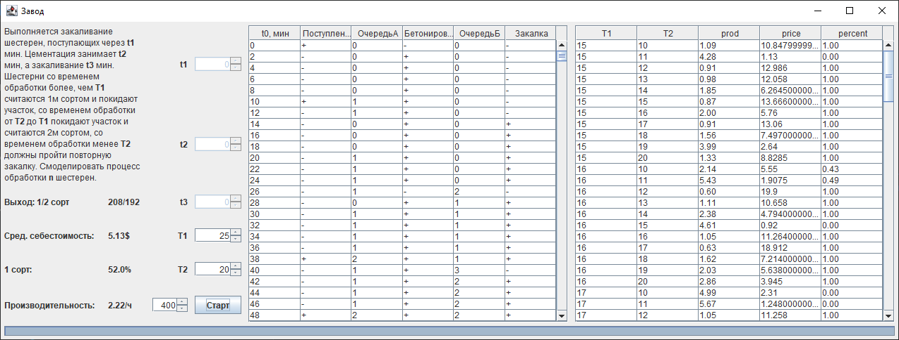

# Gear-production-model
 На участке термической обработки выполняется цементация и закаливание шестерен, поступающих через t1(мин). 
 Цементация занимает t2(мин), а закаливание –t3(мин). 
 Шестернисо временем обра-ботки больше Т1 покидают участок и считаются 1-м сортом, со временем обработки от Т2 до Т1 покидают участок и считаются 2-м сортом, со временем обработки менее Т2 должны пройти повторную закалку. 
 Смоделировать процесс обработки 400 шестерен.
 Данные длядетерминированной модели СМО:t1= 40, t2=10, t3=33, T1=25, T2=20.
 Данные для стохастической модели СМО:интервал t2 распределен  по  нормальному  закону  с  параметрами m2=10, σ2=2,5;
 интервал t3 имеет показательное распределение с параметром λ3=0,03; интервал t1 является стационарным случайным процессом с нормальным законом распределения и интервалом разброса [8...12].
 Варьируемые параметры:Т1, Т2.Показатели  работы:производительность  участка,  средняя себестоимость обработки шестерни, процент продукции 1-го сорта.
